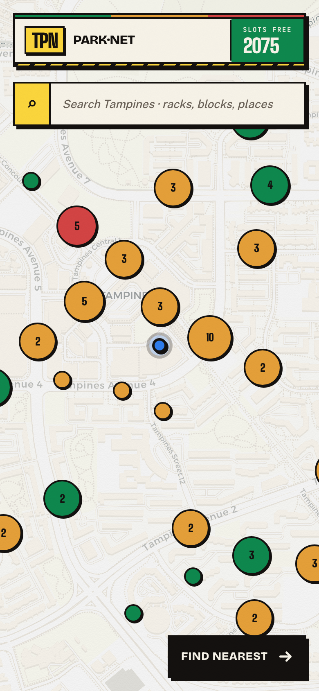
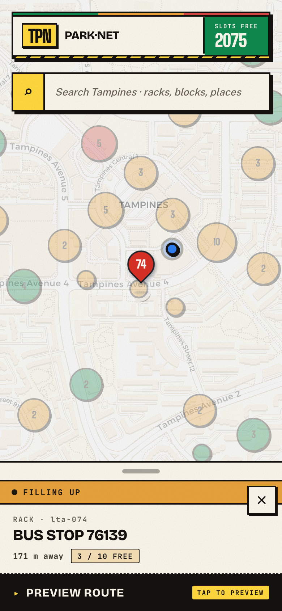
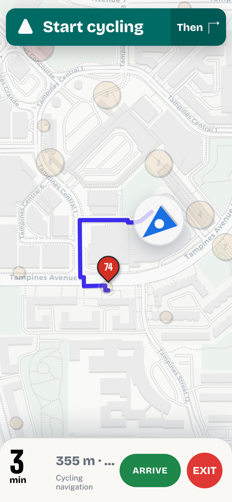
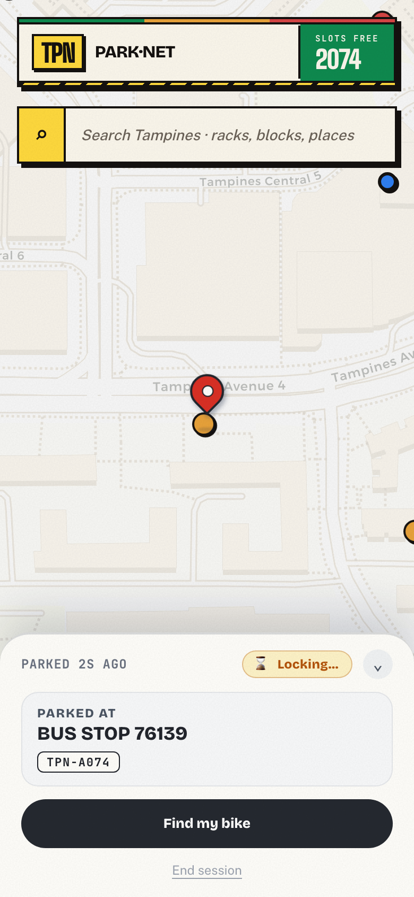
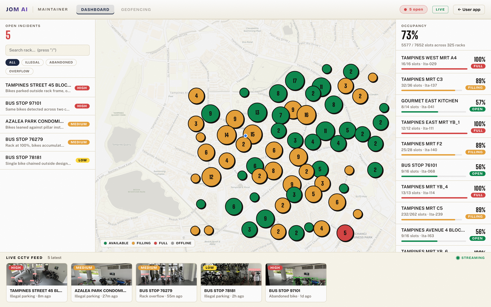
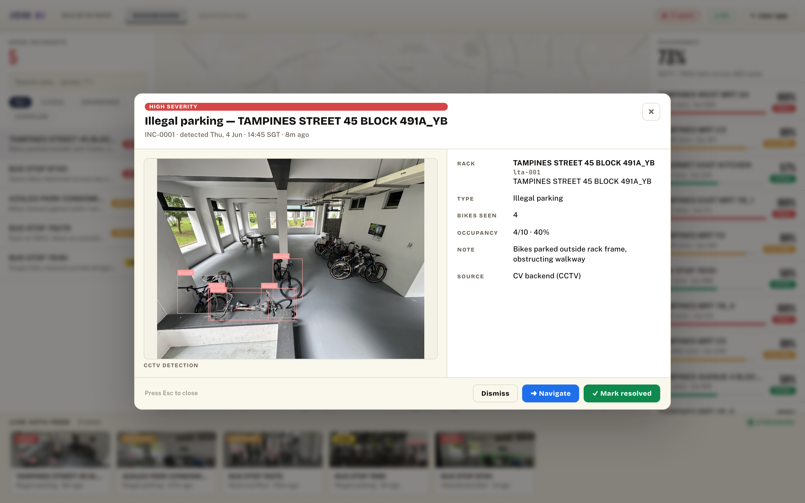
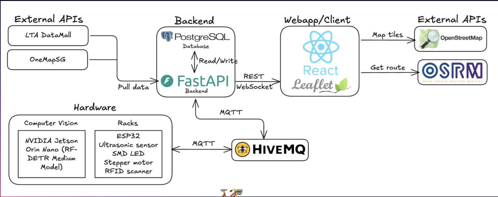

# Tampines Bicycle Rack Network

Live availability map for Tampines bike racks, with a rider app for finding a free rack and a maintainer console for triaging illegal and abandoned-bike incidents. Built for the Jom AI @ Tampines hackathon.

This repository is the **webapp / client** of a larger system (see [Architecture](#architecture)). The ESP32 smart racks and the computer-vision detection are built and maintained separately; the backend and database integration is a future plan. None of those are included in this repo.

## The problem

Bicycle racks in Tampines are usually over 75% full, and an estimated 25–50% of parked bikes are abandoned, occupying slots that active cyclists need. Riders park illegally because they cannot tell where the next free rack is, and the town council has no easy way to find and clear abandoned bikes.

The app addresses both: riders see live availability and get routed to the nearest free rack; maintainers get a console that surfaces CCTV-detected illegal parking, abandoned bikes, and rack overflow for triage. Full rationale and interview notes are in [`docs/proposal.md`](docs/proposal.md).

## Screenshots

The rider app is mobile-first; the maintainer console is a desktop layout. A splash screen routes into either based on role (`#/user` or `#/admin`).

### Rider app

Find a rack, check its details, navigate there, and park.

| 1. Find a rack | 2. Check details | 3. Navigate | 4. Park and lock |
|:---:|:---:|:---:|:---:|
|  |  |  |  |

### Maintainer console

Incident triage, rack occupancy, and a live CCTV feed in one view.



Incident detail, with the CCTV detection that raised it:



## Architecture

The full system spans hardware, a backend, and this client. Map tiles come from OpenStreetMap and routes from OSRM. Smart racks (ESP32) and computer-vision cameras (NVIDIA Jetson) report over MQTT (HiveMQ) to a FastAPI + PostgreSQL backend, which pulls reference data from LTA DataMall and OneMapSG and serves the client.



This repository holds the Webapp/Client box. The webapp talks directly to LTA DataMall and OSRM (proxied through Vite) and connects to the HiveMQ broker for live lock state, so it runs on its own. The ESP32 racks and computer-vision detection are built separately; wiring the client to the FastAPI + PostgreSQL backend is a future plan.

### Webapp stack

| Layer | Technology |
|---|---|
| UI framework | React 19 + Vite |
| Map | Leaflet + react-leaflet (CartoDB Positron tiles) |
| Geospatial | Turf.js (point-in-polygon geofencing) |
| Realtime | MQTT over WSS (HiveMQ Cloud) for rack lock sessions |
| Routing | OSRM bike profile (`routing.openstreetmap.de`) |
| Rack data | LTA DataMall, proxied through Vite |
| Styling | Plain CSS (no UI framework) |

### Rack locking over MQTT

The webapp is the one part of the system wired to hardware in real time. A single shared connection ([`webapp/src/services/mqttClient.js`](webapp/src/services/mqttClient.js)) reaches a HiveMQ Cloud broker over secure WebSocket (WSS):

- It subscribes to `esp32/door/state`. The ESP32 publishes `locked` or `unlocked`, and that message drives the rider's parking-session card (the "Locking…" and locked states shown in the screenshots).
- Lock and unlock commands travel on `esp32/door/command`.

If `VITE_MQTT_URL` is not set the client becomes a no-op, so the app still runs without a broker (lock state stays inactive). Topic names are configurable via the `VITE_MQTT_TOPIC_*` variables in [Configuration](#configuration).

## Getting started

Requires Node.js 18+ and npm.

```bash
cd webapp
cp .env.example .env.local      # fill in keys (see Configuration)
npm install
npm run dev
```

Open http://localhost:5173. Without API keys the app still runs on bundled rack data with occupancy simulated locally and MQTT disabled; keys enable live data.

| URL | View |
|---|---|
| `/` | Role splash |
| `/#/user` | Rider app |
| `/#/admin` | Maintainer console |
| `/?reset=1` | Clear saved role and return to splash |

Other scripts: `npm run build` (production build to `webapp/dist`), `npm run preview`, `npm run lint`.

## Configuration

Config is via Vite env vars in `webapp/.env.local` (gitignored). Copy `webapp/.env.example` to start. All values are optional and degrade gracefully when unset.

| Variable | Purpose | Source |
|---|---|---|
| `VITE_LTA_KEY` | LTA DataMall AccountKey for real rack locations | [datamall.lta.gov.sg](https://datamall.lta.gov.sg/content/datamall/en/request-for-api.html) |
| `VITE_ORS_KEY` | OpenRouteService key (alternative routing) | [openrouteservice.org](https://openrouteservice.org/dev/#/signup) |
| `VITE_MQTT_URL` | HiveMQ Cloud broker URL (WSS) for lock state | HiveMQ Cloud |
| `VITE_MQTT_USER` / `VITE_MQTT_PASS` | MQTT credentials | HiveMQ Cloud |
| `VITE_MQTT_TOPIC_STATE` | Rack lock-state topic (default `esp32/door/state`) | — |
| `VITE_MQTT_TOPIC_COMMAND` | Lock/unlock command topic (default `esp32/door/command`) | — |

LTA DataMall does not send CORS headers, so the Vite dev server proxies `/lta` to DataMall and `/api` to a local FastAPI backend if one is running. See [`webapp/vite.config.js`](webapp/vite.config.js).

## Features

Rider app:

- Availability-coloured rack map with search and clustering
- Tap a rack for capacity, distance, and a cycling-route preview
- Find Nearest available rack from your location
- Park, lock, and unlock session flow over MQTT

Maintainer console:

- Incident feed (illegal parking, abandoned bikes, overflow) filterable by type and severity
- Incident detail with CCTV detection imagery and navigate/resolve actions
- Occupancy map and per-rack utilisation list

## Roadmap

| Feature | Status |
|---|---|
| Rider map, markers, side panel, legend | Done |
| LTA DataMall rack data and clustering | Done |
| Find Nearest available + cycling route | Done |
| Local occupancy simulation | Done |
| Maintainer console (incidents, occupancy, nav) | Done |
| MQTT lock/unlock sessions | Done |
| ESP32 smart racks (ultrasonic, LED, stepper, RFID) | Done |
| Computer-vision illegal-parking detection (Jetson + RF-DETR) | Done |
| Geofencing overflow zones | Future plan |
| FastAPI + PostgreSQL backend integration | Future plan |

## Project structure

```
.
├── webapp/                     React + Vite frontend (this repo)
│   ├── src/
│   │   ├── components/         Rider UI (map, search, nav, lock cards)
│   │   ├── components/admin/   Maintainer console
│   │   ├── data/              Rack data, occupancy sim, geo helpers, GeoJSON
│   │   └── services/          MQTT, routing (OSRM), API client
│   └── vite.config.js          Dev proxies for LTA DataMall and backend
├── docs/                       Proposal, design notes, diagram, screenshots
├── backend/                    Planned: FastAPI + PostGIS
└── firmware/                   Planned: ESP32 device code
```

## Acknowledgements

Built for the Jom AI @ Tampines hackathon. Team: Alvin, Lebin, Mike, Nicolas, and Reeve.

Data and services: rack data from LTA DataMall, map tiles from OpenStreetMap and CartoDB, and cycling routes from OSRM.
